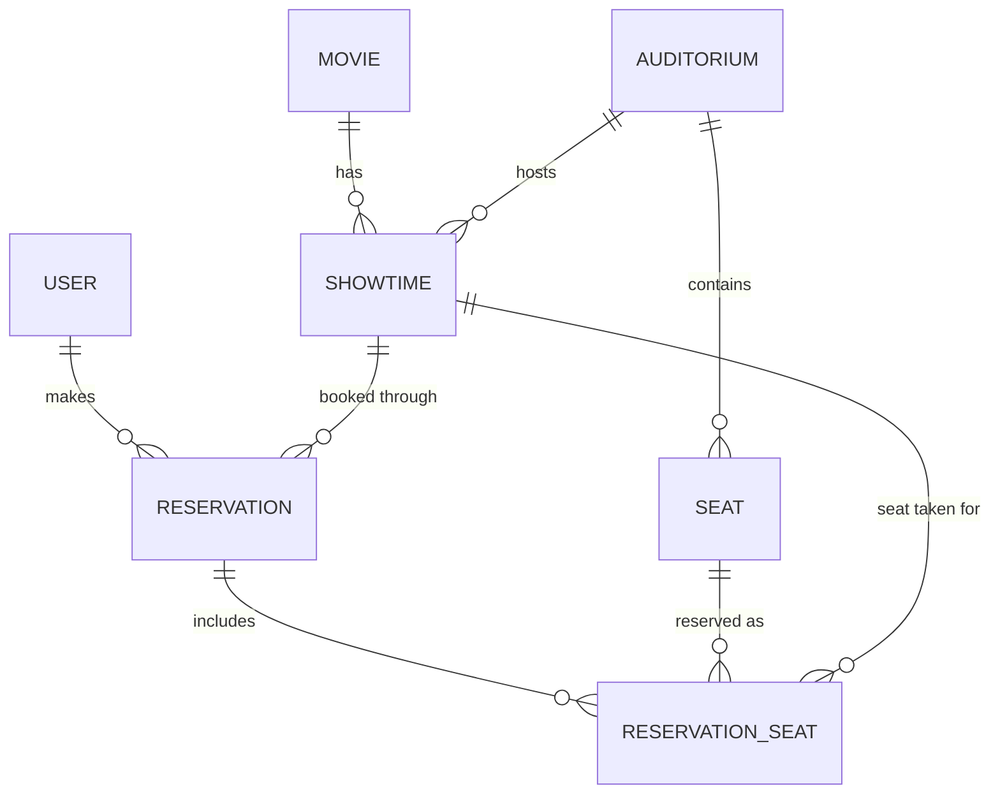

```mermaid
erDiagram
    USER ||--o{ RESERVATION : makes
    MOVIE ||--o{ SHOWTIME : has
    AUDITORIUM ||--o{ SEAT : contains
    AUDITORIUM ||--o{ SHOWTIME : hosts
    SHOWTIME ||--o{ RESERVATION : "booked through"
    RESERVATION ||--o{ RESERVATION_SEAT : includes
    SEAT ||--o{ RESERVATION_SEAT : "reserved as"
    SHOWTIME ||--o{ RESERVATION_SEAT : "seat taken for"
```